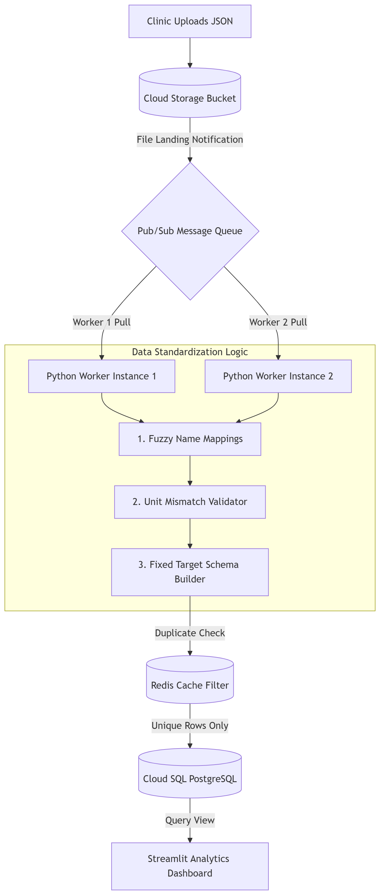

# Architecture

## High-Level Design
The Veritas Claims Pipeline is a modular, file-driven processing system with four main layers:

1. Input Layer
   - Reads JSON files from the raw queue
   - Stores valid files in processed and invalid/duplicate files in duplicates

2. Validation and Ingestion Layer
   - Parses payloads and checks for duplicates
   - Enforces minimum business rules such as trace ID presence and response details availability

3. Standardization and Analytics Layer
   - Normalizes test names using the schema dictionary
   - Extracts values, ranges, units, and categorizes test outcomes

4. Storage and Presentation Layer
   - Persists records in SQLite
   - Exposes backend endpoints and a Streamlit dashboard

## Proposed Architecture Diagram

## Medium-Scale Architecture Overview
This design is optimized for a medium-scaling workload where ingestion, validation, and standardization are decoupled to keep the pipeline resilient during bursts of file uploads and processing demand.

## Pros and Trade-offs
### Pros
- High Resilience: A message queue between the generation of data and processing workers prevents sudden upload spikes from overwhelming the workers at a particular time of the day.
- Cost-Efficient Scaling: Python workers can scale up or down dynamically based on workload, reducing unnecessary infrastructure cost.
- Fast In-Memory Deduplication: A Redis-based filter/cache can identify duplicate trace IDs quickly before writing to the main database.
- Pub/Sub Architecture : The publisher/clinic publishes at high rates can be subscribed by the engine as per it's usage and not overwhelm by the sudden spikes

### Trade-offs
- Configuration Dependency Rigidity: Static schema mappings can require frequent updates when new clinic-specific test names or formats appear.
- Eventual Consistency: Because processing is asynchronous, downstream reporting and dashboards may show data slightly later than the moment a file is uploaded.

## Component Responsibilities
- Ingestion Layer: manages file movement and pipeline execution
- Standardization Engine: transforms raw clinical data into structured records
- Database Service: handles persistence and duplicate-aware insert behavior
- Dashboard: offers monitoring and manual pipeline controls

## Data Flow
A JSON file moves through the following steps:
1. File is discovered in the raw folder
2. Content is parsed and validated
3. Duplicate checks are performed
4. Lab data is standardized
5. Records are written to the database
6. The file is moved to processed or duplicates